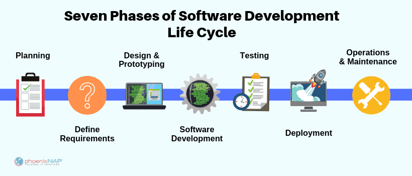
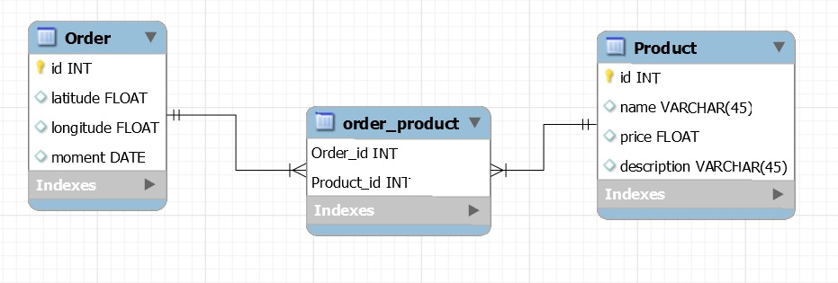
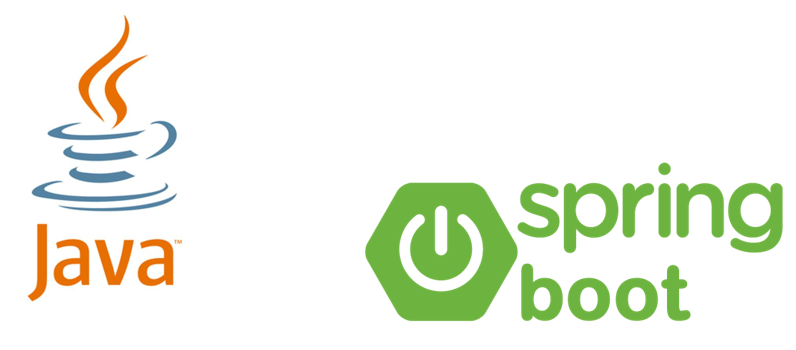
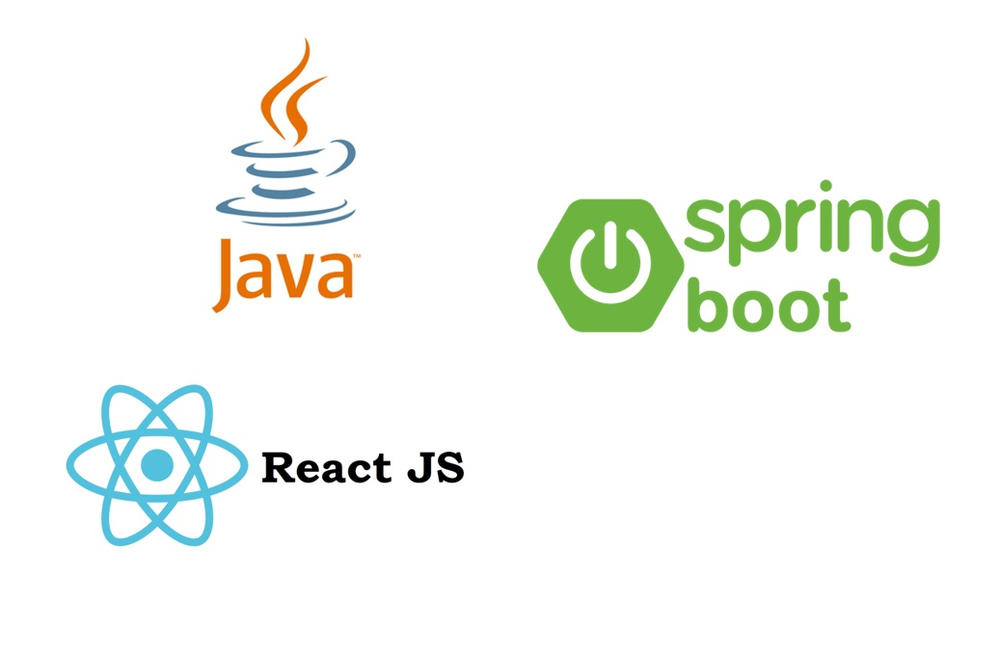
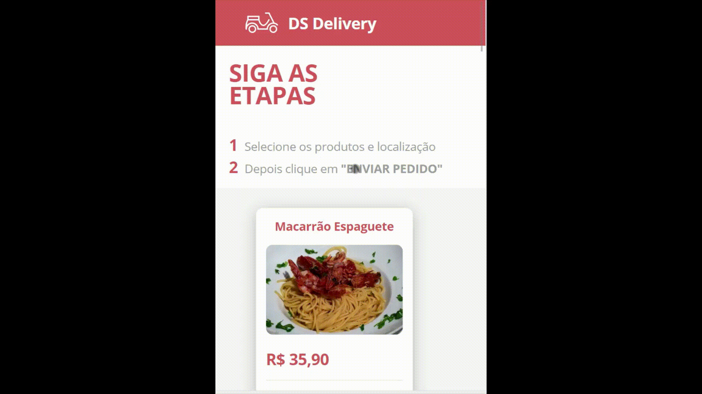
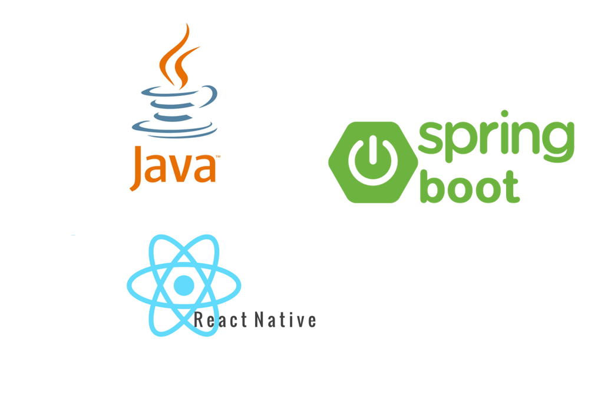
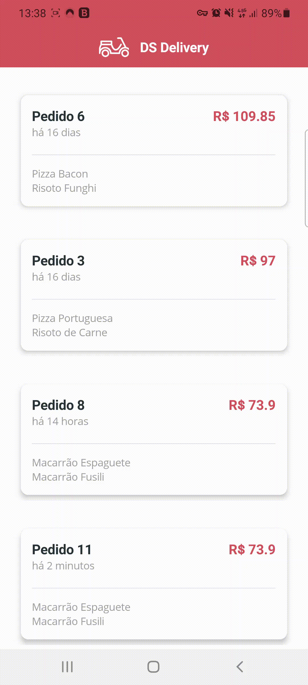

<h1 align="center"> Basic Tutorial of Project Design </h1>

# Content

1. [Project Status](#projectstatus)
2. [About the Project](#abouttheproject)
3. [Project Description](#projectdescription)
4. [Chapter 1: Phases of a Project](#chapter1)
    - [Chapter 1 - Part 1: Basic Phases of a Project](#chapter1part1)
    - [Chapter 1 - Part 2: Software Development Life Cycle](#chapter1part2)
    - [Chapter 1 - Part 3: Planning](#chapter1part3)
    - [Chapter 1 - Part 4: Define Requirements](#chapter1part4)
    - [Chapter 1 - Part 5: Design and Prototyping](#chapter1part5)
    - [Chapter 1 - Part 6: Software development](#chapter1part6)
    - [Chapter 1 - Part 7: Testing](#chapter1part7)
    - [Chapter 1 - Part 8: Deployment](#chapter1part8)
    - [Chapter 1 - Part 9: Operations and Maintenance](#chapter1part9)
5. [Chapter 2:  System Overview](#chapter2)
    - [Chapter 2 - Part 1: Project Scope](#chapter2part1)
    - [Chapter 2 - Part 2: Project Detaling](#chapter2part2)
    - [Chapter 2 - Part 3: Entities and Entities Attribute](#chapter2part3)
6. [Chapter 3: Design UI/UX](#chapter3)
    - [Chapter 3 - Part 1: Project Wireframe Design](#chapter3part1)
    - [Chapter 3 - Part 2: How to Make a Wireframe](#chapter3part2)
7. [Chapter 4: Specify Use Cases](#chapter4)
    - [Chapter 4 - Part 1: Use Cases](#chapter4part1)
8. [Chapter 5: Domain Model](#chapter5)
    - [Chapter 5 - Part 1: What is Domain Model?](#chapter5part1)
    - [Chapter 5 - Part 2: Domain Model Abstraction Level](#chapter5part2)
    - [Chapter 5 - Part 3: Conceptual Domain Model (Business)](#chapter5part3)
    - [Chapter 5 - Part 4: Conceptual Domain Model (System)](#chapter5part4)
    - [Chapter 5 - Part 5: Logical Level Domain Model (Relational)](#chapter5part5)
    - [Chapter 5 - Part 6: Logical Level Domain Model (Object Oriented)](#chapter5part6)
    - [Chapter 5 - Part 7: Physical Level Domain Model (Relational)](#chapter5part7)
    - [Chapter 5 - Part 8: Physical Level Domain Model (Object Oriented)](#chapter5part8)
9. [Chapter 6: Development](#chapter6)
    - [Chapter 6 - Part 1: Back end](#chapter6part1)
    - [Chapter 6 - Part 2: Web App](#chapter6part2)
    - [Chapter 6 - Part 3: Mobile App](#chapter6part3)
10. [Usage](#usage)
11. [Contributors](#contributors)
12. [Contributing](#contributing)
13. [Roadmap](#roadmap)
14. [To Do](#todo)
15. [Contacts](#contacts)
16. [License](#license)

# Project Status <a name="projectstatus"></a>

Project Status: Concluded :heavy_check_mark:

# About the Project <a name="abouttheproject"></a>

This project have a propose to introduce the reader to basic concepts of create a software project.

[![Project][project-shield]][project-url] <!-- Put the link of the github page of the tutorial her -->

This tutorial was based in the course from Phd Professor [Nelio Alves - UML Design][umlcourse-url] and the Youtube Channel [DevSuperior][devsuperior-url].

# Project Description <a name="projectdescription"></a>

This project have the object to introduce the reader the basics of "How to start and create a software" in the development world. I think, many of us, have the skills of programm (knowledge in oriented object programm language, relational database, Front-end tools like HTML, CSS and Javascript) but don't have the basics of how to get the ideia that is in the head and pass to a paper.

This tutorial will show a basic way in step-by-step form how to start simple project.

This tutorial will not cover more specific concepts of software development (Scrum, Agile and etc ...), just the basics of "How to create software".

## <a name="chapter1"></a>Chapter 1: Phases of a Project

#### <a name="chapter1part1"></a>Chapter 1 - Part 1: Basic Phases of a Project

Let's define 5 phases to create a project:
   - Describe a system overview (Project Scope and Detaling the Project)
   - Design the UI/UX Project
   - Specify Use Cases
   - Design Conceptual Model
   - Development (Develop back end, web app and mobile app)
    
<br>

<div align="center"><br><sub>Fig 1 - Basic Phases of a Project</sub></div>

<br>

#### <a name="chapter1part2"></a>Chapter 1 - Part 2: Software Development Life Cycle

The phases of a project listed above, is a simple overview of how to create a simple project. In enterprise systems, software applications follow the **SDLC, or Software Development Life Cycle**. Is a set of steps used to create software applications and this steps divide the development process into tasks that can then be assigned, completed, and measured.

It’s typically divided into six to eight steps: Planning, Requirements, Design, Build, Document, Test, Deploy, Maintain. Some project managers will combine, split, or omit steps, depending on the project’s scope. These are the core components recommended for all software development projects.
 
SDLC is a way to measure and improve the development process. It allows a fine-grain analysis of each step of the process. This, in turn, helps companies maximize efficiency at each stage. As computing power increases, it places a higher demand on software and developers. Companies must reduce costs, deliver software faster, and meet or exceed their customers’ needs. SDLC helps achieve these goals by identifying inefficiencies and higher costs and fixing them to run smoothly.

<br>

<div align="center"><br><sub>Fig 2 - The Seven Phases of the SDLC - (<a href='https://phoenixnap.com/blog/software-development-life-cycle#:~:text=Software%20Development%20Life%20Cycle%20is,%2C%20Test%2C%20Deploy%2C%20Maintain.'>Work created by Goran Jevtic</a>) </sub></div>
</sub></div>

<br>

The Software Development Life Cycle simply outlines each task required to put together a software application. This helps to reduce waste and increase the efficiency of the development process. Monitoring also ensures the project stays on track, and continues to be a feasible investment for the company.

Many companies will subdivide these steps into smaller units. Planning might be broken into technology research, marketing research, and a cost-benefit analysis. Other steps can merge with each other. The Testing phase can run concurrently with the Development phase, since developers need to fix errors that occur during testing.

#### <a name="chapter1part3"></a>Chapter 1 - Part 3: Planning

In the Planning phase, project leaders evaluate the terms of the project. This includes calculating labor and material costs, creating a timetable with target goals, and creating the project’s teams and leadership structure.

Planning can also include feedback from stakeholders. Stakeholders are anyone who stands to benefit from the application. Try to get feedback from potential customers, developers, subject matter experts, and sales reps.

Planning should clearly define the scope and purpose of the application. It plots the course and provisions the team to effectively create the software. It also sets boundaries to help keep the project from expanding or shifting from its original purpose.

#### <a name="chapter1part4"></a>Chapter 1 - Part 4: Define Requirements

Defining requirements is considered part of planning to determine what the application is supposed to do and its requirements. For example, a social media application would require the ability to connect with a friend. An inventory program might require a search feature.

Requirements also include defining the resources needed to build the project. For example, a team might develop software to control a custom manufacturing machine. The machine is a requirement in the process.

#### <a name="chapter1part5"></a>Chapter 1 - Part 5: Design and Prototyping

The Design phase models the way a software application will work. Some aspects of the design include:

- **Architecture** – Specifies programming language, industry practices, overall design, and use of any templates or boilerplate

- **User Interface** – Defines the ways customers interact with the software, and how the software responds to input

- **Platforms** – Defines the platforms on which the software will run, such as Apple, Android, Windows version, Linux, or even gaming consoles

- **Programming** – Not just the programming language, but including methods of solving problems and performing tasks in the application

- **Communications** – Defines the methods that the application can communicate with other assets, such as a central server or other instances of the application

- **Security** – Defines the measures taken to secure the application, and may include SSL traffic encryption, password protection, and secure storage of user credentials

Prototyping can be a part of the Design phase. A prototype is like one of the early versions of software in the Iterative software development model. It demonstrates a basic idea of how the application looks and works. This “hands-on” design can be shown to stakeholders. Use feedback o improve the application. It’s less expensive to change the Prototype phase than to rewrite code to make a change in the Development phase.

#### <a name="chapter1part6"></a>Chapter 1 - Part 6: Software Development

This is the actual writing of the program. A small project might be written by a single developer, while a large project might be broken up and worked by several teams. Use an Access Control or Source Code Management application in this phase. These systems help developers track changes to the code. They also help ensure compatibility between different team projects and to make sure target goals are being met.

The coding process includes many other tasks. Many developers need to brush up on skills or work as a team. Finding and fixing errors and glitches is critical. Tasks often hold up the development process, such as waiting for test results or compiling code so an application can run. SDLC can anticipate these delays so that developers can be tasked with other duties.

Software developers appreciate instructions and explanations. Documentation can be a formal process, including wiring a user guide for the application. It can also be informal, like comments in the source code that explain why a developer used a certain procedure. Even companies that strive to create software that’s easy and intuitive benefit from the documentation.

Documentation can be a quick guided tour of the application’s basic features that display on the first launch. It can be video tutorials for complex tasks. Written documentation like user guides, troubleshooting guides, and FAQ’s help users solve problems or technical questions.

#### <a name="chapter1part7"></a>Chapter 1 - Part 7: Testing

It’s critical to test an application before making it available to users. Much of the testing can be automated, like security testing. Other testing can only be done in a specific environment – consider creating a simulated production environment for complex deployments. Testing should ensure that each function works correctly. Different parts of the application should also be tested to work seamlessly together—performance test, to reduce any hangs or lags in processing. The testing phase helps reduce the number of bugs and glitches that users encounter. This leads to a higher user satisfaction and a better usage rate.

#### <a name="chapter1part8"></a>Chapter 1 - Part 8: Deployment

In the deployment phase, the application is made available to users. Many companies prefer to automate the deployment phase. This can be as simple as a payment portal and download link on the company website. It could also be downloading an application on a smartphone.

Deployment can also be complex. Upgrading a company-wide database to a newly-developed application is one example. Because there are several other systems used by the database, integrating the upgrade can take more time and effort.

#### <a name="chapter1part9"></a>Chapter 1 - Part 9: Operations and Maintenance

At this point, the development cycle is almost finished. The application is done and being used in the field. The Operation and Maintenance phase is still important, though. In this phase, users discover bugs that weren’t found during testing. These errors need to be resolved, which can spawn new development cycles.

In addition to bug fixes, models like Iterative development plan additional features in future releases. For each new release, a new Development Cycle can be launched.
  
## <a name="chapter2"></a>Chapter 2: System Overview

#### <a name="chapter2part1"></a>Chapter 2 - Part 1: Project Scope

The Project Scope is the first part of how to elaborate a project.

In the project scope, we will elaborate the delimitations of the project, what is part of the project and what is not and another aspects like goals, deliveries, tasks, responsabilities, deadlines and costs.

In the example below, we will make a scope of a simple project.

| Project Scope Statement                                  |                                                               |                           
|:---------------------------------------------------------|---------------------------------------------------------------|
| **Project Name**                                         | Order registration and delivery system for a pizzeria         |
| **Project Sponsor**                                      | John Ries, CEO                                                |
| **Project Manager**                                      | Vitor Garcia                                                  |
| **Date of Approval**                                     | 06/30/2019                                                    |
| **Last Updated**                                         | 06/15/2019                                                    |

1. **Scope Description**

    Purpose of the project is to optimize the delivery and order register client in GoodPi Pizzeria located in São Paulo, Brazil.

2. **Project Deliverables**

    **major project activities:**
    - project planning.
    - requirement specification.
    - software installation.
    - adjust software to client’s needs.
    - training of pizzeria employers and couriers staff.

    **deliverables:**
    - project schedule.
    - requirement specification document.
    - ready-to-use system.
    - training plan.
    - training manual.

3. **Acceptance Criteria**

    Successful move to new system solution over the weekend (10/27/19 – 10/28/19).

4. **Constraints**

    Due to delivery commitments to customers the system transition must be performed during the weekend.

5. **Assumptions**

    InventoryMaster consultants take over installation and configuration of software.

#### <a name="chapter2part2"></a>Chapter 2 - Part 2: Project Detaling
 
 In the example below, we will make a basic description of the project we are using like example.

The pizzeria GoodPi, want to implement a order and delivery system. The client enter in the website of the GoodPi and select the product that he want. This product have a id, name, price, description and image. After the client register the order, this order will generate a localization (latitude and longitude) of the client and a moment that will be send to the courier to the delivery and will be generated to the courier a map with the delivery address of the client. The order have a status and a total of the order. Each order have a localization and a order can have multiple products.
 
#### <a name="chapter2part3"></a>Chapter 2 - Part 3: Entities and Entities Attribute

After the description, check what is will be your entities and entities attributes in the description and highlight the text:

<div align="center"><br><sub>Fig 2 - Entities of the Project</sub></div>

## <a name="chapter3"></a>Chapter 3: Design UI/UX

#### <a name="chapter3part1"></a>Chapter 3 - Part 1: Project Wireframe Design

A wireframe is a two-dimensional skeletal outline of a webpage or app. Wireframes provide a clear overview of the page structure, layout, information architecture, user flow, functionality, and intended behaviors. As a wireframe usually represents the initial product concept, styling, color, and graphics are kept to a minimum. Wireframes can be drawn by hand or created digitally, depending on how much detail is required.

<br>

<div align="center"><br><sub>Fig 3 - Web App Wireframe Example (https://www.visual-paradigm.com/features/ux-design-and-wireframe-tools/)</sub></div>

<br>

<div align="center"><br><sub>Fig 4 - Mobile App Wireframe Example (https://www.visual-paradigm.com/features/ux-design-and-wireframe-tools/)</sub></div>

<br>

#### <a name="chapter3part2"></a>Chapter 3 - Part 2: How to Make a Wireframe

We can make a simple wireframe, using [Figma][figma-url] or [Adobe XD][adobexd-url] to make a simple wireframe. You will make a draft of the user interfaces and the UI/UX designer will develop the user interface propertily.

Below, is a wireframe design and the final web app develop.

<br>

<div align="center"><br><sub>Fig 5 - Wireframe Vs Final (https://www.wirify.com/)</sub></div>

<br>

<div align="center"><br><sub>Fig 6 - The Final UI/UX Design</sub></div>

<br>

<div align="center"><br><sub>Fig 7 - The Final UI/UX Design</sub></div>

<br>

## <a name="chapter4"></a>Chapter 4: Use Cases

#### <a name="chapter4part1"></a>Chapter 4 - Part 1: Use Cases

The Use Case is a useful tool to specify what will be the input from the user and what will the the output from the system.

In the example below, we will make a use case of the project we are using like example.

#### Register Order
1. [OUT] The system show a list with name, price, description and images of all products, ordered by name.
2. [IN] The client select the desire products and inform the delivery location of the order.
3. [OUT] The system inform the order id.

#### Deliver Order
1. [OUT] The system show a list with id, total value, instant and items of the pending orders, ordered by oldest to youngest.
2. [IN] The courier select the order.
3. [OUT] The system inform a map with the route till the delivery location.
4. [IN] The courier inform that the order was delivered.

## <a name="chapter5"></a>Chapter 5: Domain Model

#### <a name="chapter5part1"></a>Chapter 5 - Part 1: What is Domain Model?

A domain model is a visual representation of real situation objects in a domain. A domain is an area of concern. Its used to refer to the area you are dealing with. The model is a diagram, for domain models the class diagram UML is mostly used. 

#### <a name="chapter5part2"></a>Chapter 5 - Part 2: Domain Model Abstraction Level

| Level                                           | Responsible                                                   | Objective                                                                                                                                                      | Tools                                         | 
|-------------------------------------------------|---------------------------------------------------------------|----------------------------------------------------------------------------------------------------------------------------------------------------------------|-----------------------------------------------|
| Conceptual Domain Model (Business)              | Business Analyst                                              | Describe the domain (business) entities and their interrelationships: Regardless of the System                                                                 | Entity–relationship model (or ER mode)        |
| Conceptual Domain Model (System)                | Systems Analyst                                               | Describe the domain (system) entities and their interrelationships: Regardless of paradigm and technology                                                      | Class Diagram (Without OO Elements)           |
| Logical Level Domain Model (Relational)         | Designer                                                      | Describe the domain (system) entities and their interrelationships: <br> - Stuck in a paradigm (Ex: Relational) <br> - Technology independent                  | Relational Model (Or RM)                      |
| Logical Level Domain Model (Object Oriented)    | Designer                                                      | Describe the domain (system) entities and their interrelationships: <br> - Stuck in a paradigm (Ex: Object Oriented) <br> - Technology independent             | Class Diagram                                 |
| Physical Level Domain Model (Relational)        | Implementer                                                   | Describe the domain (system) entities and their interrelationships: <br> - Stuck in a paradigm (Ex: Relational) <br> - Technology Dependent (Ex: MySQL)        | SQL                                           |
| Physical Level Domain Model (Object Oriented)   | Implementer                                                   | Describe the domain (system) entities and their interrelationships: <br> - Stuck in a paradigm (Ex: Object Oriented) <br> - Technology Dependent (Ex: Java)    | Java, C#                                      |

#### <a name="chapter5part3"></a>Chapter 5 - Part 3: Conceptual Domain Model (Business)

<br>

<div align="center"><br><sub>Fig 8 - Conceptual Domain Model (Business)</sub></div>

<br>

#### <a name="chapter5part4"></a>Chapter 5 - Part 4: Conceptual Domain Model (System)

<br>

<div align="center"><br><sub>Fig 9 - Conceptual Domain Model (System)</sub></div>

<br>

#### <a name="chapter5part5"></a>Chapter 5 - Part 5: Logical Level Domain Model (Relational)

<br>

<div align="center"><br><sub>Fig 10 - Logical Level Domain Model (Relational)</sub></div>

<br>

#### <a name="chapter5part6"></a>Chapter 5 - Part 6: Logical Level Domain Model (Object Oriented)

<br>

<div align="center"><br><sub>Fig 11 - Logical Level Domain Model (Object Oriented)</sub></div>

<br>

#### <a name="chapter5part7"></a>Chapter 5 - Part 7: Physical Level Domain Model (Relational)

```sql
INSERT INTO tb_order (latitude, longitude, moment) VALUES (-23.561680, -46.656139, TIMESTAMP WITH TIME ZONE '2021-01-01T09:00:00Z');
INSERT INTO tb_order (latitude, longitude, moment) VALUES (-23.561680, -46.656139, TIMESTAMP WITH TIME ZONE '2021-01-01T09:00:00Z');
INSERT INTO tb_order (latitude, longitude, moment) VALUES (-23.561680, -46.656139, TIMESTAMP WITH TIME ZONE '2021-01-01T09:00:00Z');
INSERT INTO tb_order (latitude, longitude, moment) VALUES (-23.561680, -46.656139, TIMESTAMP WITH TIME ZONE '2021-01-01T09:00:00Z');
INSERT INTO tb_order (latitude, longitude, moment) VALUES (-23.561680, -46.656139, TIMESTAMP WITH TIME ZONE '2021-01-01T09:00:00Z');
INSERT INTO tb_order (latitude, longitude, moment) VALUES (-23.561680, -46.656139, TIMESTAMP WITH TIME ZONE '2021-01-01T09:00:00Z');
```

#### <a name="chapter5part8"></a>Chapter 5 - Part 8: Physical Level Domain Model (Object Oriented)

```java
@Entity
@Table(name = "tb_order")
public class Order implements Serializable {
	private static final long serialVersionUID = 1L;
	
	@Id
	@GeneratedValue(strategy = GenerationType.IDENTITY)
	private Long id;
	private Double latitude;
	private Double longitude;
	private Instant moment;
```

## <a name="chapter6"></a>Chapter 6: Development

#### <a name="chapter6part1"></a>Chapter 6 - Part 1: Back end

The [source code back end][source-url]

<br>

<div align="center"><br><sub>Fig 12 - Back End Tools</sub></div>

<br>

#### <a name="chapter6part2"></a>Chapter 6 - Part 2: Web App

[The Web App Deploy][web-app-url]

<br>

<div align="center"><br><sub>Fig 13 - Web App Tools</sub></div>

<br>

<div align="center"><br><sub>Fig 14 - Web App Deploy</sub></div>

<br>

#### <a name="chapter6part3"></a>Chapter 6 - Part 3: Mobile App

<br>

<div align="center"><br><sub>Fig 15 - Mobile App Tools</sub></div>

<br>

<div align="center"><br><sub>Fig 16 - Web App Deploy</sub></div>

<br>

# Usage <a name="usage"></a>

Using this like a bibliography if you want to remember project design concepts.

# Contributors <a name="contributors"></a>

| [ <br> <sub> Vitor Garcia </sub>][github-url] | 
| :-----------------------------------------------------------------------------------------------------: |

# Contributing <a name="contributing"></a>

Contributions are what make the open source community such an amazing place to be learn, inspire, and create. Any contributions you make are **greatly appreciated**.

1. Fork the Project
2. Create your Feature Branch (`git checkout -b feature/AmazingFeature`)
3. Commit your Changes (`git commit -m 'Add some AmazingFeature'`)
4. Push to the Branch (`git push origin feature/AmazingFeature`)
5. Open a Pull Request

# Roadmap <a name="roadmap"></a>

See the [![Issues][issues-shield]][issues-url]  for a list of proposed features (and known issues).

# To Do <a name="todo"></a>

Project Completed

# Contacts <a name="contacts"></a>

| Vitor Garcia                                     |
| :----------------------------------------------- |
| [![LinkedIn][linkedin-shield]][linkedin-url]     |
| [![Portfolio][portfolio-shield]][portfolio-url]  |
| [![GitHub][github-shield]][github-url]           |

# License <a name="License"></a>

- [![MIT License][license-shield]][license-url]

- Distributed under the MIT License. See `LICENSE` for more information.


<!-- README TUTORIALS -->

<!--

https://dev.to/reginadiana/como-escrever-um-readme-md-sensacional-no-github-4509

-->

<!-- 

Mark Down Guide - Readme Text Format Style

https://www.markdownguide.org/

-->

<!-- 

How to Create your Badges

https://gist.github.com/rupeshtiwari/8558ca0d8ec1c15619e4492dcd6aa81a

-->

<!-- USEFUL LINKS -->

<!--

Free Images Without Copyright

https://unsplash.com/


-->

<!-- MY BADGES -->

[project-shield]: https://img.shields.io/badge/link-project-green.svg
[project-url]: https://github.com/vitorstabile/projects-design-basics
[linkedin-shield]: https://img.shields.io/badge/my-linkedin-blue.svg 
[linkedin-url]: https://www.linkedin.com/in/vitor-stabile-garcia-5b151b67
[portfolio-shield]: https://img.shields.io/badge/my-portfolio-red.svg
[portfolio-url]: https://vitorstabile.github.io
[github-shield]: https://img.shields.io/badge/my-github-green.svg
[github-url]: https://github.com/vitorstabile
[issues-shield]: https://img.shields.io/badge/link-issues-green.svg
[issues-url]: https://github.com/vitorstabile/projects-design-basics/issues
[license-shield]: https://img.shields.io/badge/license-mit-blue.svg 
[license-url]: https://github.com/vitorstabile/projects-design-basics/blob/master/LICENSE.txt
[figma-url]: https://www.figma.com/
[adobexd-url]: https://www.adobe.com/products/xd.html
[umlcourse-url]: https://www.udemy.com/course/uml-diagrama-de-classes/
[devsuperior-url]: https://www.youtube.com/watch?v=PfYifUFmXk8
[source-url]: https://github.com/vitorstabile/dsdeliver-sds2/blob/main/backend/src/main/java/com/devsuperior/dsdeliver/entities/Order.java
[web-app-url]: https://vitorgarciasds2.netlify.app/
