<h1 align="center"> Basic Tutorial of Project Design </h1>

# Content

1. [Project Status](#projectstatus)
2. [About the Project](#abouttheproject)
3. [Project Description](#projectdescription)
4. [Chapter 1: Project Scope](#chapter1)
    - [Chapter 1 - Part 1: Project Scope Diagram](#chapter1part1)
    - [Chapter 1 - Part 2: Project Scope Example](#chapter1part2)
5. [Chapter 2: Project Description](#chapter2)
    - [Chapter 2 - Part 1: Detailing the Project](#chapter2part1)
    - [Chapter 2 - Part 2: Example of Project Detaling](#chapter2part2)
    - [Chapter 2 - Part 3: Entities and Entities Attribute in Description](#chapter2part3)
6. [Chapter 3: Project Use Case](#chapter3)
    - [Chapter 3 - Part 1: Use Case](#chapter3part1)
    - [Chapter 3 - Part 2: Use Case Example](#chapter3part2)
7. [Chapter 4: Project Wireframe](#chapter4)
    - [Chapter 4 - Part 1: Project Wireframe Design](#chapter4part1)
    - [Chapter 4 - Part 2: How to Make a Wireframe](#chapter4part2)
    - [Chapter 4 - Part 3: The Real Wireframe](#chapter4part3)
8. [Chapter 5: Project Domain Model](#chapter5)
    - [Chapter 5 - Part 1: Phases of a Project](#chapter5part1)
    - [Chapter 5 - Part 2: Domain Model Abstraction Level](#chapter5part2)
    - [Chapter 5 - Part 3: Conceptual Domain Model (Business)](#chapter5part3)
    - [Chapter 5 - Part 4: Conceptual Domain Model (System)](#chapter5part4)
    - [Chapter 5 - Part 5: Logical Level Domain Model (Relational)](#chapter5part5)
    - [Chapter 5 - Part 6: Logical Level Domain Model (Object Oriented)](#chapter5part6)
    - [Chapter 5 - Part 7: Physical Level Domain Model (Relational)](#chapter5part7)
    - [Chapter 5 - Part 8: Physical Level Domain Model (Object Oriented)](#chapter5part8)
    - [Chapter 5 - Part 9: The Example Domain Model](#chapter5part9)
9. [Usage](#usage)
10. [Contributors](#contributors)
11. [Contributing](#contributing)
12. [Roadmap](#roadmap)
13. [To Do](#todo)
14. [Contacts](#contacts)
15. [License](#license)

# Project Status 

Project Status: Concluded :heavy_check_mark:

# About the Project 

This project have a propose to introduce the reader to basic concepts of create a software project.

[![Project][project-shield]][project-url] <!-- Put the link of the github page of the tutorial her -->

# Project Description 

This project have the object to introduce the reader the basics of "How to start and create a software" in the development world. I think, many of us, have the skills of programm (knowledge in oriented object programm language, relational database, Front-end tools like HTML, CSS and Javascript) but don't have the basics of how to get the ideia that is in the head and pass to a paper.

This tutorial will show a basic way in step-by-step form how to start simple project.

This tutorial was based in the course from Phd Professor [Nelio Alves - UML Design][umlcourse-url] and the Youtube Channel [DevSuperior][devsuperior-url].

 Fig 1 - Step-by-Step Project

  
## Chapter 1: Project Scope

#### Chapter 1 - Part 1: Project Scope Diagram

The Project Scope is the first part of how to elaborate a project.

In the project scope, we will elaborate the delimitations of the project, what is part of the project and what is not and another aspects like goals, deliveries, tasks, responsabilities, deadlines and costs.

 Fig 2 - Project Scope Phases

#### Chapter 1 - Part 2: Project Scope Example

In the example below, we will make a scope of a simple project.

| Project Scope Statement                                  |                                                               |                           
|:---------------------------------------------------------|--------------------------------------------------------------:|
| **Project Name**                                         | Order registration and delivery system for a pizzeria         |
| **Project Sponsor**                                      | John Ries, CEO                                                |
| **Project Manager**                                      | Vitor Garcia                                                  |
| **Date of Approval**                                     | 06/30/2019                                                    |
| **Last Updated**                                         | 06/15/2019                                                    |

1. **Scope Description**

    Purpose of the project is to optimize the delivery and order register client in GoodPi Pizzeria located in São Paulo, Brazil.

2. **Project Deliverables**

    **major project activities:**
    - project planning.
    - requirement specification.
    - software installation.
    - adjust software to client’s needs.
    - training of pizzeria employers and couriers staff.

    **deliverables:**
    - project schedule.
    - requirement specification document.
    - ready-to-use system.
    - training plan.
    - training manual.

3. **Acceptance Criteria**

    Successful move to new system solution over the weekend (10/27/19 – 10/28/19).

4. **Constraints**

    Due to delivery commitments to customers the system transition must be performed during the weekend.

5. **Assumptions**

    InventoryMaster consultants take over installation and configuration of software.

## Chapter 2: Project Description

#### Chapter 2 - Part 1: Detailing the Project

After make the project scope, we have to make a detail description of the project.

Make a description of the project is put all the details of the software (what he will have, the entities and the relation with them). Just make a simple description and pay attention in this details.

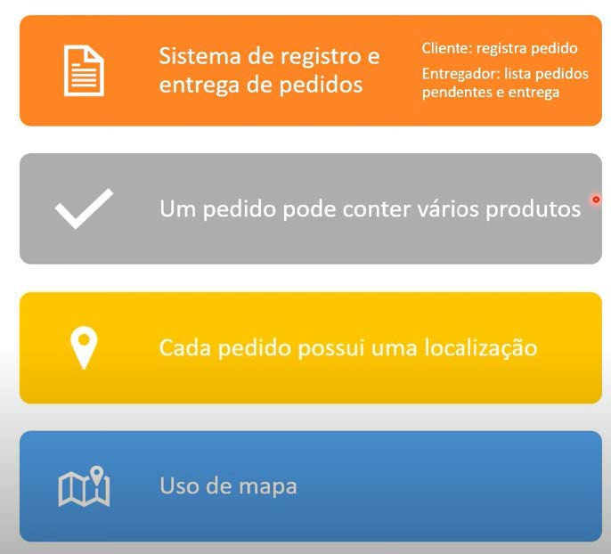 Fig 3 - Project Description Example

#### Chapter 2 - Part 2: Example of Project Detaling

In the example below, we will make a basic description of the project we are using like example.

The pizzeria GoodPi, want to implement a order and delivery system. The client enter in the website of the GoodPi and select the product that he want. This product have a id, name, price, description and image. After the client register the order, this order will generate a localization (latitude and longitude) of the client and a moment that will be send to the courier to the delivery and will be generated to the courier a map with the delivery address of the client. The order have a status and a total of the order. Each order have a localization and a order can have multiple products.

#### Chapter 2 - Part 3: Entities and Entities Attribute in Description

After the description, check what is will be your entities and entities attributes in the description and highlight the text:

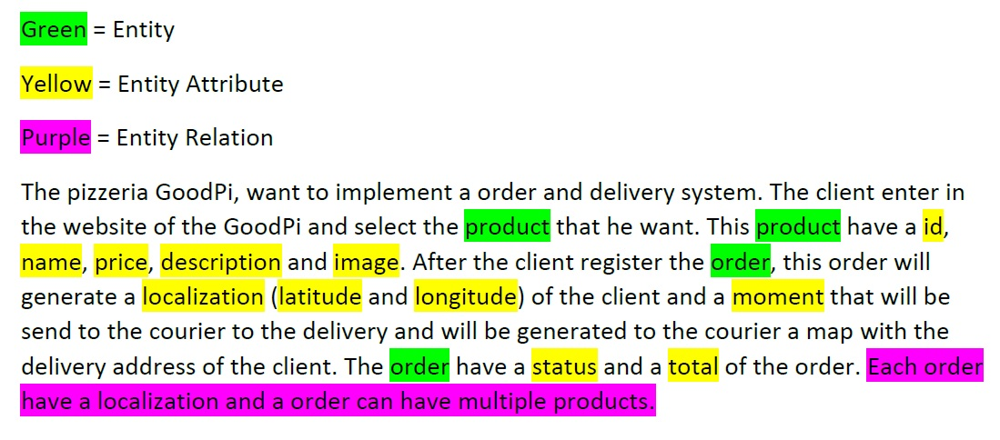 Fig 4 - Highlight Entities in Description

## Chapter 3: Project Use Case

#### Chapter 3 - Part 1: Use Case

The Use Case is a useful tool to specify what will be the input from the user and what will the the output from the system.

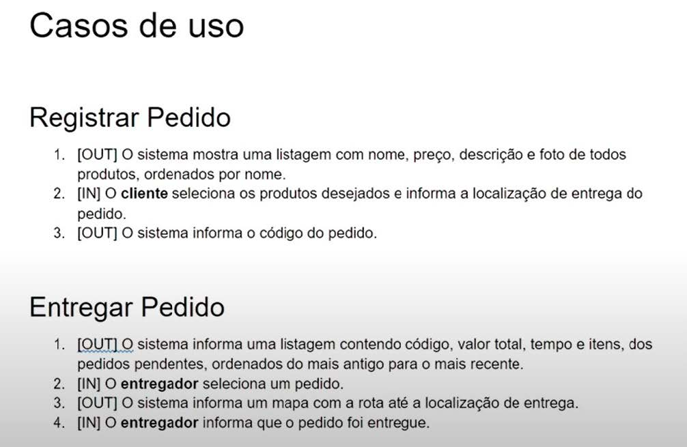 Fig 5 - Project Use Case

#### Chapter 3 - Part 2: Use Case Example

In the example below, we will make a use case of the project we are using like example.

#### Register Order
1. [OUT] The system show a list with name, price, description and images of all products, ordered by name.
2. [IN] The client select the desire products and inform the delivery location of the order.
3. [OUT] The system inform the order id.

#### Deliver Order
1. [OUT] The system show a list with id, total value, instant and items of the pending orders, ordered by oldest to youngest.
2. [IN] The courier select the order.
3. [OUT] The system inform a map with the route till the delivery location.
4. [IN] The courier inform that the order was delivered.

## Chapter 4: Project Wireframe

#### Chapter 4 - Part 1: Project Wireframe Design

A wireframe is a two-dimensional skeletal outline of a webpage or app. Wireframes provide a clear overview of the page structure, layout, information architecture, user flow, functionality, and intended behaviors. As a wireframe usually represents the initial product concept, styling, color, and graphics are kept to a minimum. Wireframes can be drawn by hand or created digitally, depending on how much detail is required.

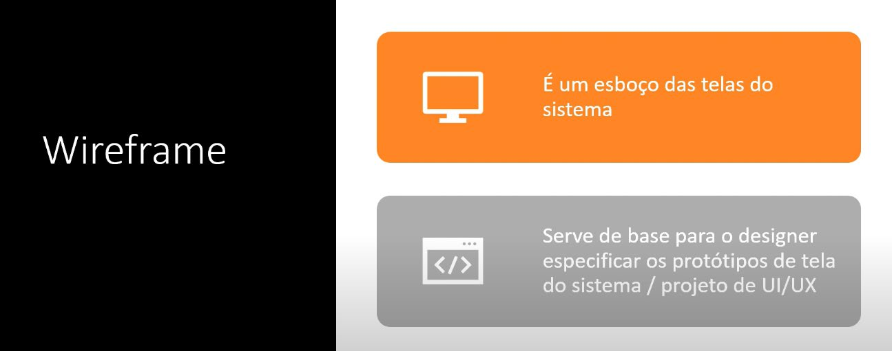 Fig 6 - Project Wireframe

#### Chapter 4 - Part 2: How to Make a Wireframe

We can make a simple wireframe, using [Figma][figma-url] or [Adobe XD][adobexd-url] to make a simple wireframe. You will make a draft of the user interfaces and the UI/UX designer will develop the user interface propertily.

Down below, is the wireframe example of the home page and the products page in a computer view.

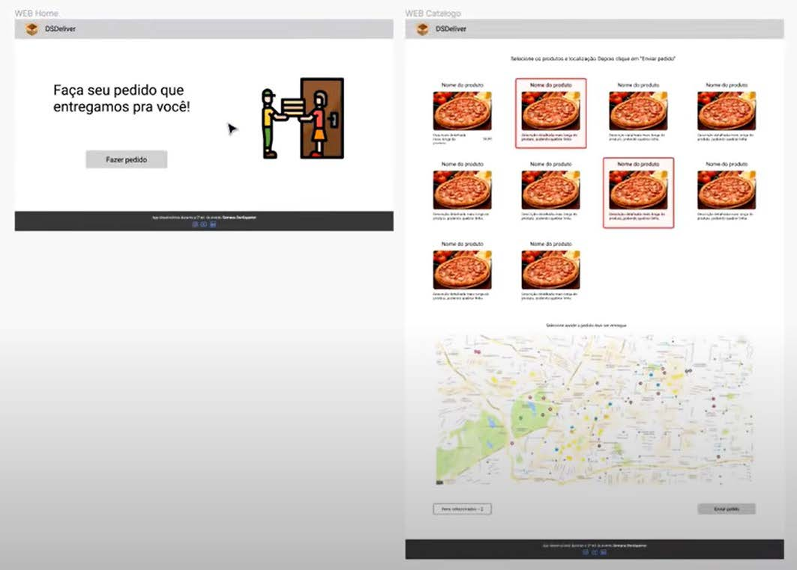 Fig 7 - Project Web Wireframe

Down below, is the wireframe in the mobile app.

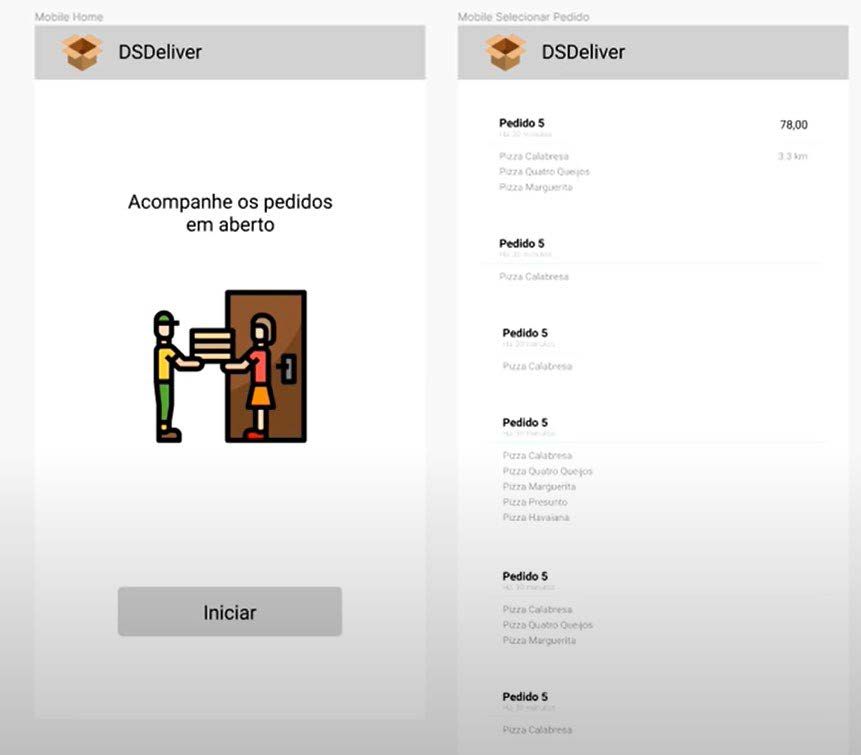 Fig 6 - Project Mobile Wireframe

#### Chapter 4 - Part 3: The Real Wireframe

After present the draft models of the wireframe to UI/UX designer, he will make the properly interface, like below.

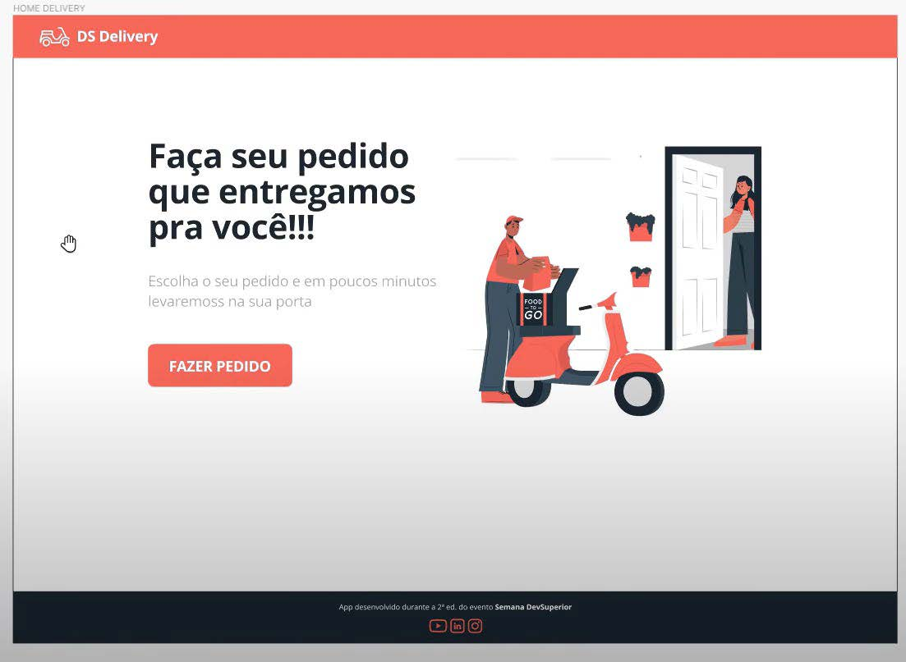 Fig 8 - UI/UX Web Interface

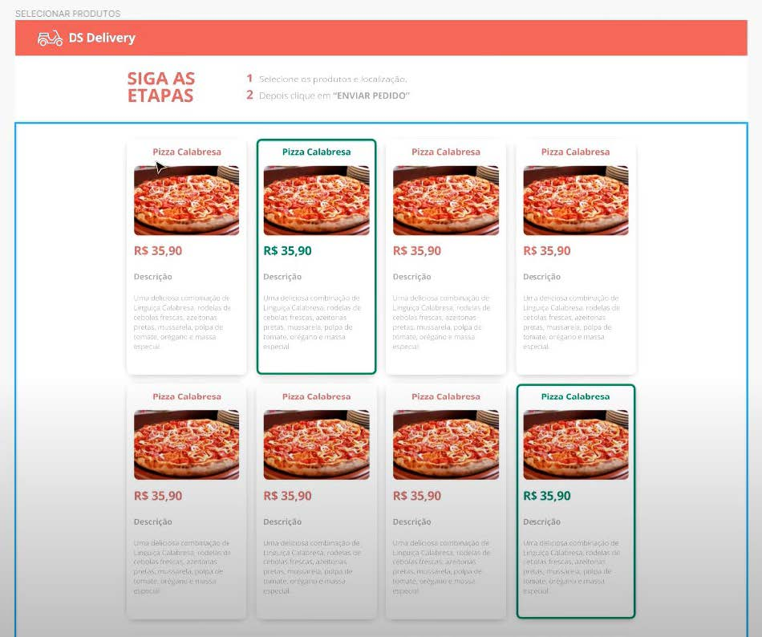 Fig 9 - UI/UX Web Interface

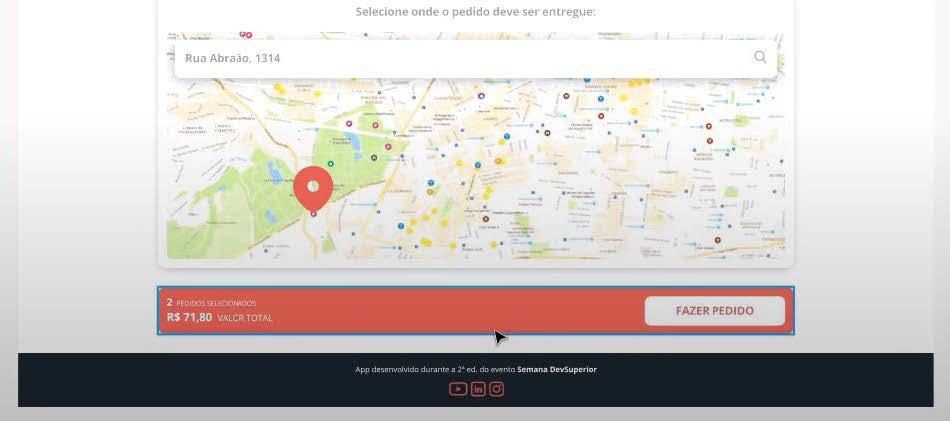 Fig 10 - UI/UX Web Interface

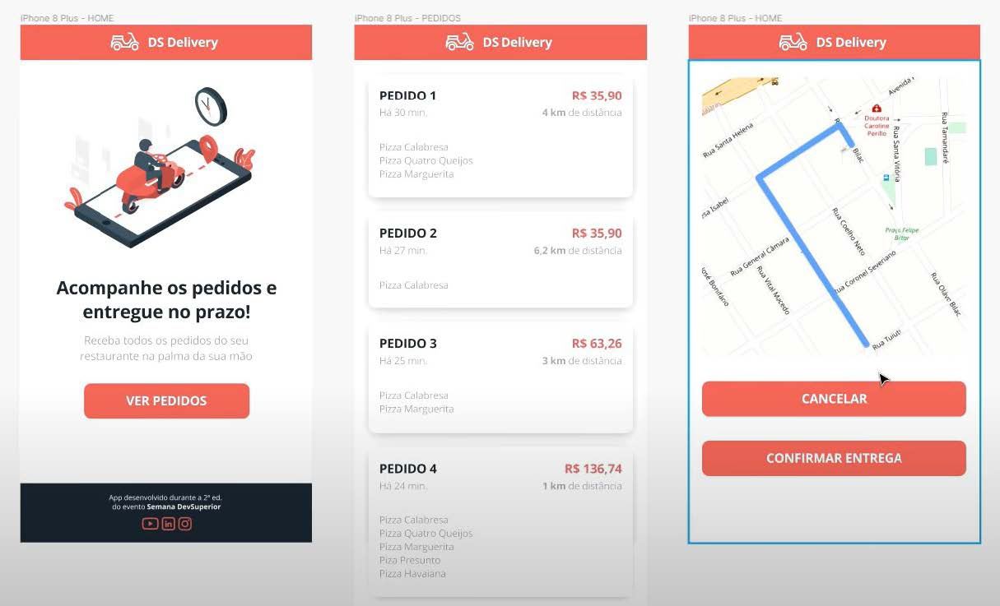 Fig 11 - UI/UX App Interface

## Chapter 5: Project Domain Model

#### Chapter 5 - Part 1: Phases of a Project

The phases of a project consist in disciplines (Bussiness Modelling, Requirements, Analysis & Design...) working together in different phases (Inception, Elaboration, Construction and Trasition) and different iterations in a instant of time.

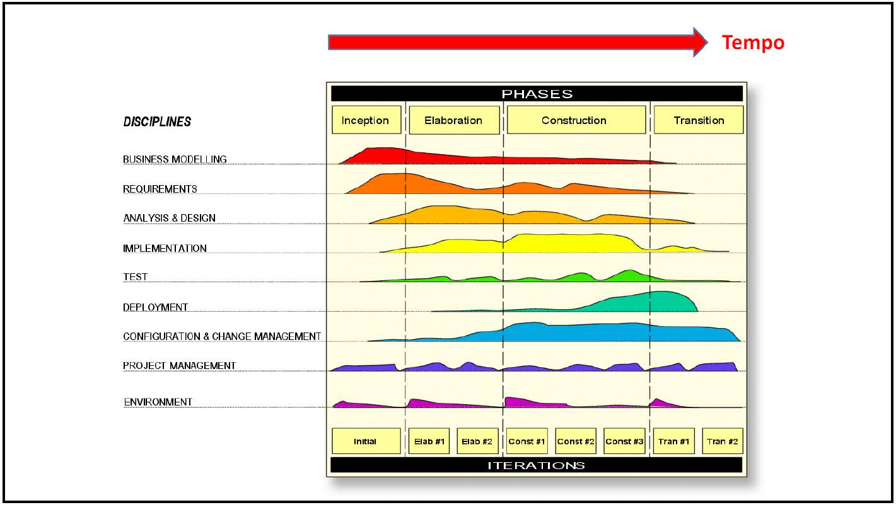 Fig 11 - Phases of a Project

#### Chapter 5 - Part 2: Domain Model Abstraction Level

The Domain Model is required in the Bussiness Modelling, Requirements and Analysis & Design phase

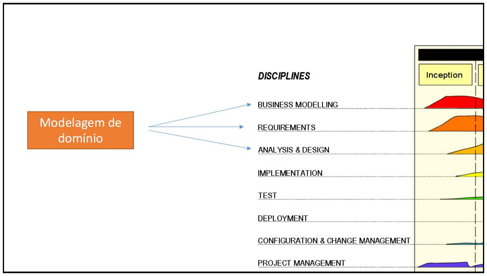 Fig 12 - Domain Model Phases Required Level

The Domain Model have abstraction levels, like below.

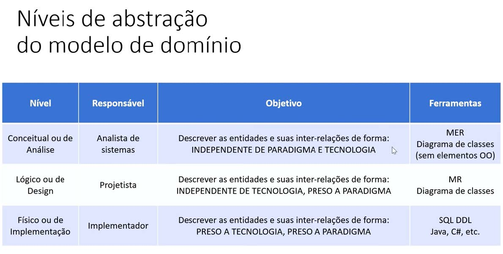 Fig 13 - Domain Model Abstraction Level

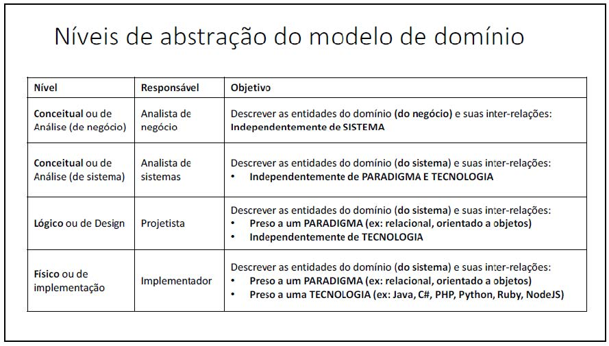 Fig 14 - Domain Model Abstraction Level

| Level                                           | Responsible                                                   | Objective                                                                                                                                                      | Tools                                         | 
|-------------------------------------------------|---------------------------------------------------------------|----------------------------------------------------------------------------------------------------------------------------------------------------------------|-----------------------------------------------|
| Conceptual Domain Model (Business)              | Business analyst                                              | Describe the domain (business) entities and their interrelationships: Regardless of the System                                                                 | Entity–relationship model (or ER mode)        |
| Conceptual Domain Model (System)                | Systems Analyst                                               | Describe the domain (system) entities and their interrelationships: Regardless of paradigm and technology                                                      | Class Diagram (Without OO Elements)           |
| Logical Level Domain Model (Relational)         | Designer                                                      | Describe the domain (system) entities and their interrelationships:   - Stuck in a paradigm (Ex: Relational)   - Technology independent                  | Relational Model (Or RM)                      |
| Logical Level Domain Model (Object Oriented)    | Designer                                                      | Describe the domain (system) entities and their interrelationships:   - Stuck in a paradigm (Ex: Object Oriented)   - Technology independent             | Class Diagram                                 |
| Physical Level Domain Model (Relational)        | Implementer                                                   | Describe the domain (system) entities and their interrelationships:   - Stuck in a paradigm (Ex: Relational)   - Technology Dependent (Ex: MySQL)        | SQL                                           |
| Physical Level Domain Model (Object Oriented)   | Implementer                                                   | Describe the domain (system) entities and their interrelationships:   - Stuck in a paradigm (Ex: Object Oriented)   - Technology Dependent (Ex: Java)    | Java, C#                                      |

#### Chapter 5 - Part 3: Conceptual Domain Model (Business)

 Fig 15 - Conceptual Domain Model (Business)

#### Chapter 5 - Part 4: Conceptual Domain Model (System)

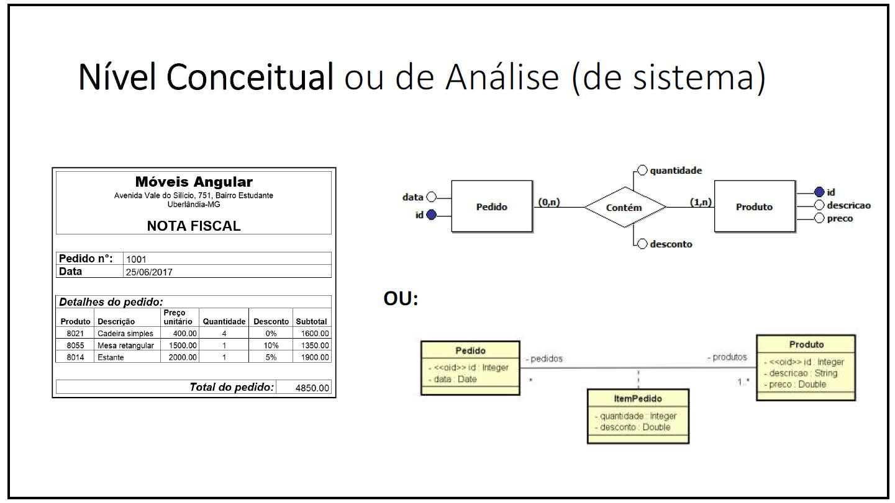 Fig 16 - Conceptual Domain Model (System)

#### Chapter 5 - Part 5: Logical Level Domain Model (Relational)

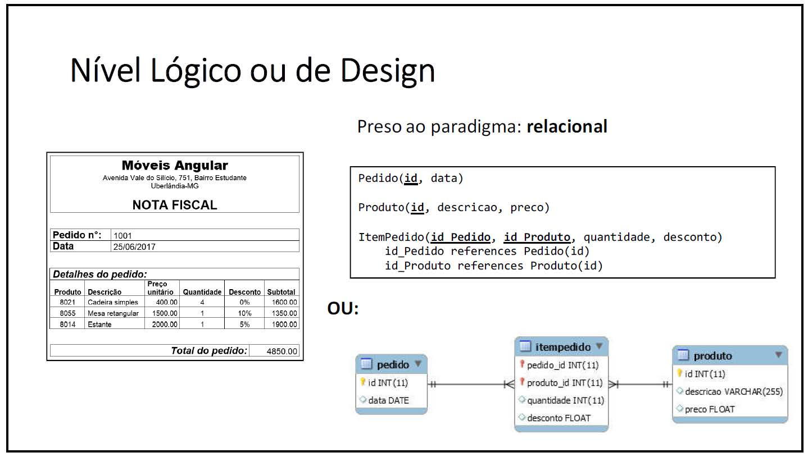 Fig 17 - Logical Level Domain Model (Relational)

#### Chapter 5 - Part 6: Logical Level Domain Model (Object Oriented)

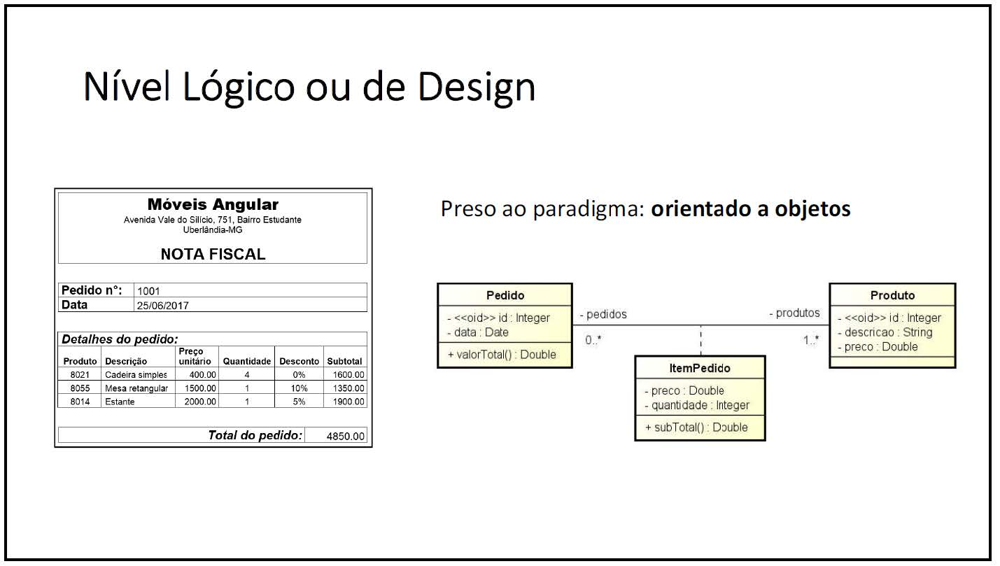 Fig 18 - Logical Level Domain Model (Object Oriented)

#### Chapter 5 - Part 7: Physical Level Domain Model (Relational)

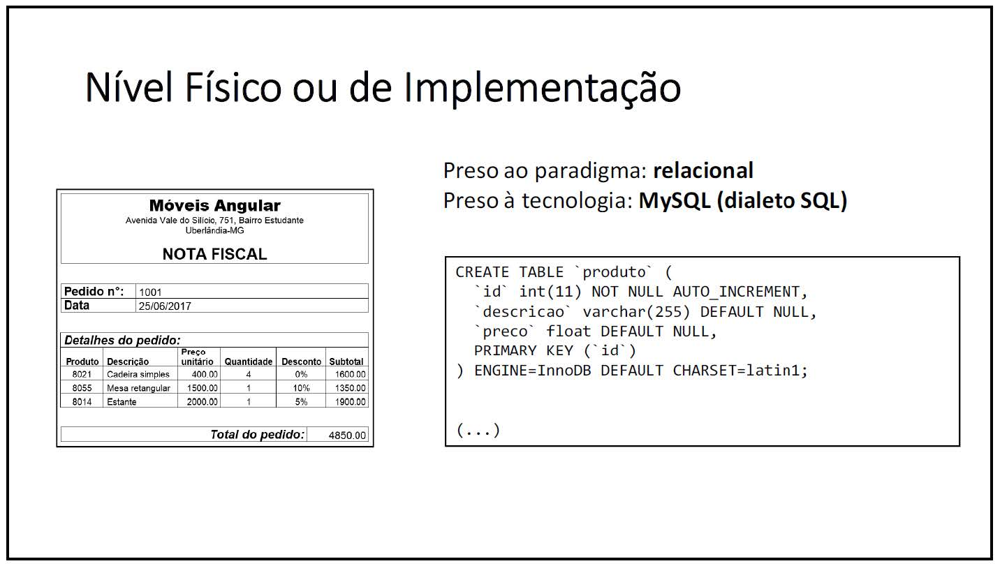 Fig 19 - Physical Level Domain Model (Relational)

#### Chapter 5 - Part 8: Physical Level Domain Model (Object Oriented)

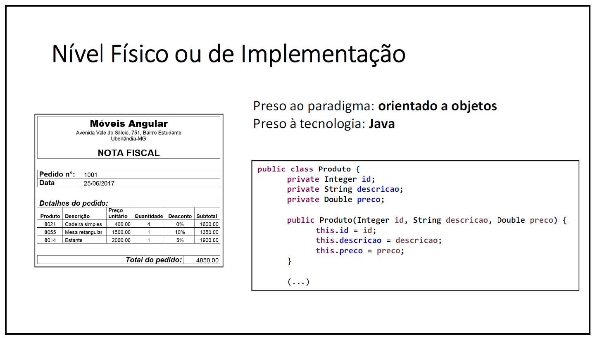 Fig 20 - Physical Level Domain Model (Object Oriented)

#### Chapter 5 - Part 9: The Example Domain Model

In the example below, we will make a Conceptual Domain Model (System) from the example and a instance of a object.

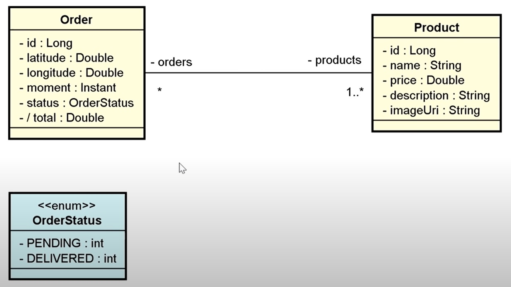 Fig 21 - Conceptual Domain Model (System)

 Fig 22 - Instance of Object of Conceptual Domain Model (System)

# Usage 

Using this like a bibliography if you want to remember project design concepts. For more information, use this [PDF][pdf-url].

# Contributors 

| [    Vitor Garcia ][github-url] | 
| :-----------------------------------------------------------------------------------------------------: |

# Contributing 

Contributions are what make the open source community such an amazing place to be learn, inspire, and create. Any contributions you make are **greatly appreciated**.

1. Fork the Project
2. Create your Feature Branch (`git checkout -b feature/AmazingFeature`)
3. Commit your Changes (`git commit -m 'Add some AmazingFeature'`)
4. Push to the Branch (`git push origin feature/AmazingFeature`)
5. Open a Pull Request

# Roadmap 

See the [![Issues][issues-shield]][issues-url]  for a list of proposed features (and known issues).

# To Do 

Project Completed

# Contacts 

| Vitor Garcia                                     |
| :----------------------------------------------- |
| [![LinkedIn][linkedin-shield]][linkedin-url]     |
| [![Portfolio][portfolio-shield]][portfolio-url]  |
| [![GitHub][github-shield]][github-url]           |

# License 

- [![MIT License][license-shield]][license-url]

- Distributed under the MIT License. See `LICENSE` for more information.

<!-- README TUTORIALS -->

<!--

https://dev.to/reginadiana/como-escrever-um-readme-md-sensacional-no-github-4509

-->

<!-- 

Mark Down Guide - Readme Text Format Style

https://www.markdownguide.org/

-->

<!-- 

How to Create your Badges

https://gist.github.com/rupeshtiwari/8558ca0d8ec1c15619e4492dcd6aa81a

-->

<!-- USEFUL LINKS -->

<!--

Free Images Without Copyright

https://unsplash.com/

-->

<!-- MY BADGES -->

[project-shield]: https://img.shields.io/badge/link-project-green.svg
[project-url]: https://github.com/vitorstabile/projects-design-basics
[linkedin-shield]: https://img.shields.io/badge/my-linkedin-blue.svg 
[linkedin-url]: https://www.linkedin.com/in/vitor-stabile-garcia-5b151b67
[portfolio-shield]: https://img.shields.io/badge/my-portfolio-red.svg
[portfolio-url]: https://vitorstabile.github.io
[github-shield]: https://img.shields.io/badge/my-github-green.svg
[github-url]: https://github.com/vitorstabile
[issues-shield]: https://img.shields.io/badge/link-issues-green.svg
[issues-url]: https://github.com/vitorstabile/projects-design-basics/issues
[license-shield]: https://img.shields.io/badge/license-mit-blue.svg 
[license-url]: https://github.com/vitorstabile/projects-design-basics/blob/master/LICENSE.txt
[pdf-url]: https://github.com/vitorstabile/projects-design-basics/blob/master/Apostila%20An%C3%A1lise%20e%20Design%20de%20Sistemas%20-%20Nelio%20Alves%20-%20Ed%202020.pdf
[figma-url]: https://www.figma.com/
[adobexd-url]: https://www.adobe.com/products/xd.html
[umlcourse-url]: https://www.udemy.com/course/uml-diagrama-de-classes/
[devsuperior-url]: https://www.youtube.com/watch?v=PfYifUFmXk8
