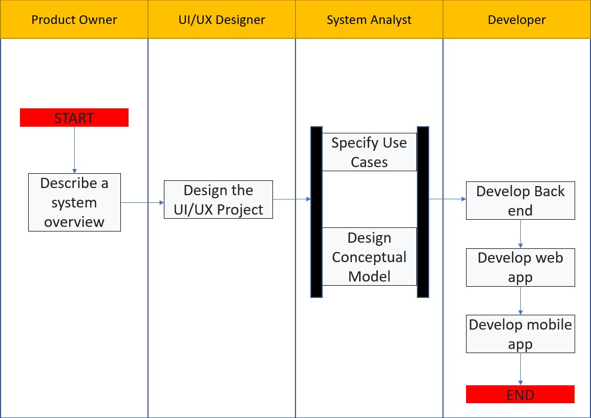
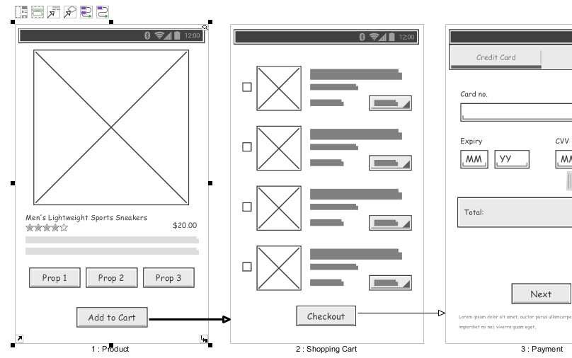
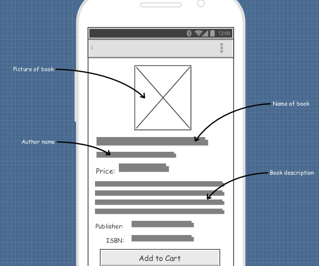
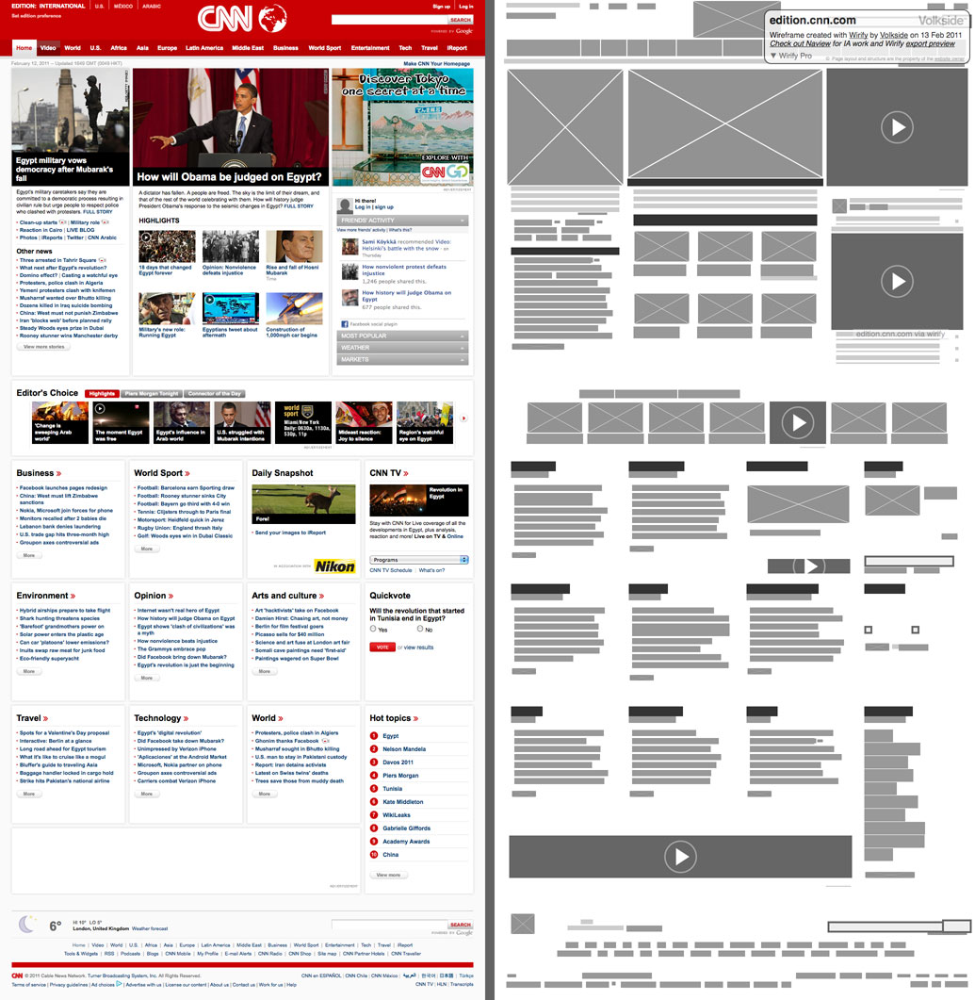
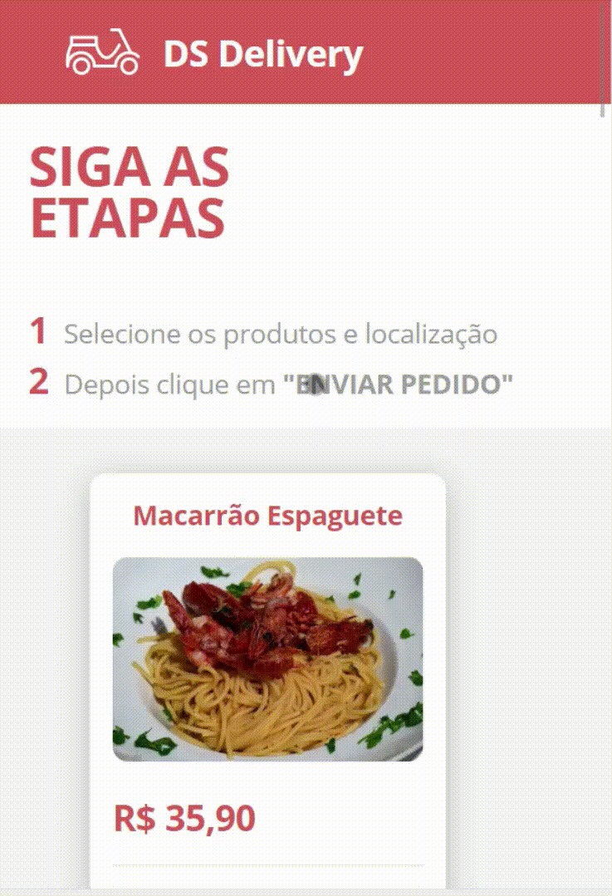
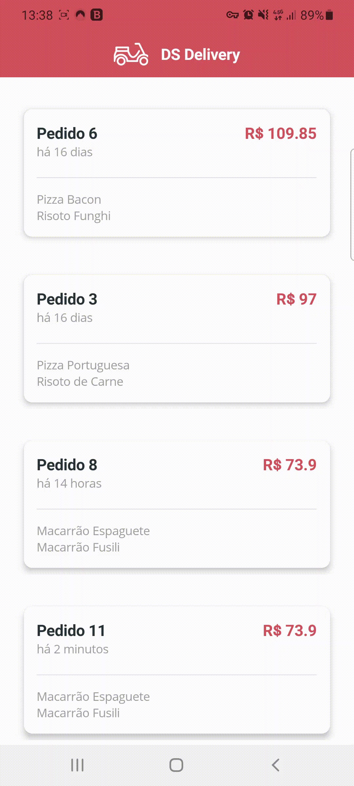
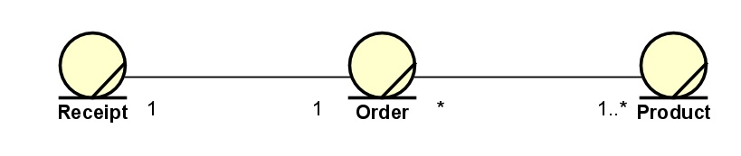
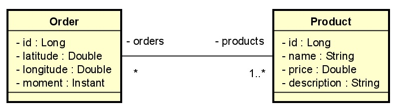
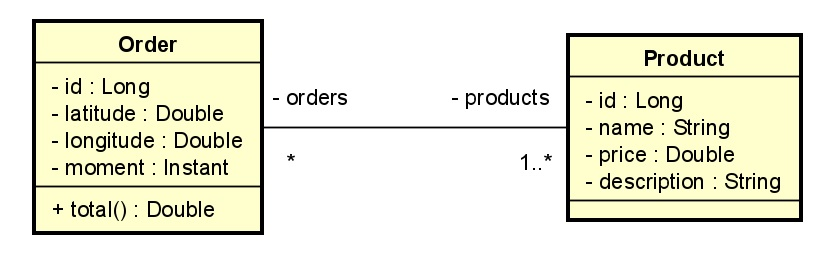

<h1 align="center"> Basic Tutorial of Project Design </h1>

# Content

1. [Project Status](#projectstatus)
2. [About the Project](#abouttheproject)
3. [Project Description](#projectdescription)
4. [Chapter 1: Phases of a Project](#chapter1)
    - [Chapter 1 - Part 1: Phases of a Project](#chapter1part1)
5. [Chapter 2:  System Overview](#chapter2)
    - [Chapter 2 - Part 1: Project Scope](#chapter2part1)
    - [Chapter 2 - Part 2: Project Detaling](#chapter2part2)
    - [Chapter 2 - Part 3: Entities and Entities Attribute](#chapter2part3)
6. [Chapter 3: Design UI/UX](#chapter3)
    - [Chapter 3 - Part 1: Project Wireframe Design](#chapter3part1)
    - [Chapter 3 - Part 2: How to Make a Wireframe](#chapter3part2)
7. [Chapter 4: Specify Use Cases](#chapter4)
    - [Chapter 4 - Part 1: Use Cases](#chapter4part1)
8. [Chapter 5: Domain Model](#chapter5)
    - [Chapter 5 - Part 1: What is Domain Model?](#chapter5part1)
    - [Chapter 5 - Part 2: Domain Model Abstraction Level](#chapter5part2)
    - [Chapter 5 - Part 3: Conceptual Domain Model (Business)](#chapter5part3)
    - [Chapter 5 - Part 4: Conceptual Domain Model (System)](#chapter5part4)
    - [Chapter 5 - Part 5: Logical Level Domain Model (Relational)](#chapter5part5)
    - [Chapter 5 - Part 6: Logical Level Domain Model (Object Oriented)](#chapter5part6)
    - [Chapter 5 - Part 7: Physical Level Domain Model (Relational)](#chapter5part7)
    - [Chapter 5 - Part 8: Physical Level Domain Model (Object Oriented)](#chapter5part8)
9. [Chapter 6: Development](#chapter6)
    - [Chapter 6 - Part 1: Back end](#chapter6part1)
    - [Chapter 6 - Part 2: Web App](#chapter6part2)
    - [Chapter 6 - Part 3: Mobile App](#chapter6part3)
10. [Usage](#usage)
11. [Contributors](#contributors)
12. [Contributing](#contributing)
13. [Roadmap](#roadmap)
14. [To Do](#todo)
15. [Contacts](#contacts)
16. [License](#license)

# Project Status <a name="projectstatus"></a>

Project Status: Concluded :heavy_check_mark:

# About the Project <a name="abouttheproject"></a>

This project have a propose to introduce the reader to basic concepts of create a software project.

[![Project][project-shield]][project-url] <!-- Put the link of the github page of the tutorial her -->

This tutorial was based in the course from Phd Professor [Nelio Alves - UML Design][umlcourse-url] and the Youtube Channel [DevSuperior][devsuperior-url].

# Project Description <a name="projectdescription"></a>

This project have the object to introduce the reader the basics of "How to start and create a software" in the development world. I think, many of us, have the skills of programm (knowledge in oriented object programm language, relational database, Front-end tools like HTML, CSS and Javascript) but don't have the basics of how to get the ideia that is in the head and pass to a paper.

This tutorial will show a basic way in step-by-step form how to start simple project.

This tutorial will not cover more specific concepts of software development (Scrum, Agile and etc ...), just the basics of "How to create software".

## <a name="chapter1"></a>Chapter 1: Phases of a Project

#### <a name="chapter1part1"></a>Chapter 1 - Part 1: Phases of a Project

Let's define 5 phases to create a project:
   - Describe a system overview (Project Scope and Detaling the Project)
   - Design the UI/UX Project
   - Specify Use Cases
   - Design Conceptual Model
   - Development (Develop back end, web app and mobile app)
    
<br>

<div align="center"><br><sub>Fig 1 - Phases of a Project</sub></div>

<br>
  
## <a name="chapter2"></a>Chapter 2: System Overview

#### <a name="chapter2part1"></a>Chapter 2 - Part 1: Project Scope

The Project Scope is the first part of how to elaborate a project.

In the project scope, we will elaborate the delimitations of the project, what is part of the project and what is not and another aspects like goals, deliveries, tasks, responsabilities, deadlines and costs.

In the example below, we will make a scope of a simple project.

| Project Scope Statement                                  |                                                               |                           
|:---------------------------------------------------------|---------------------------------------------------------------|
| **Project Name**                                         | Order registration and delivery system for a pizzeria         |
| **Project Sponsor**                                      | John Ries, CEO                                                |
| **Project Manager**                                      | Vitor Garcia                                                  |
| **Date of Approval**                                     | 06/30/2019                                                    |
| **Last Updated**                                         | 06/15/2019                                                    |

1. **Scope Description**

    Purpose of the project is to optimize the delivery and order register client in GoodPi Pizzeria located in São Paulo, Brazil.

2. **Project Deliverables**

    **major project activities:**
    - project planning.
    - requirement specification.
    - software installation.
    - adjust software to client’s needs.
    - training of pizzeria employers and couriers staff.

    **deliverables:**
    - project schedule.
    - requirement specification document.
    - ready-to-use system.
    - training plan.
    - training manual.

3. **Acceptance Criteria**

    Successful move to new system solution over the weekend (10/27/19 – 10/28/19).

4. **Constraints**

    Due to delivery commitments to customers the system transition must be performed during the weekend.

5. **Assumptions**

    InventoryMaster consultants take over installation and configuration of software.

#### <a name="chapter2part2"></a>Chapter 2 - Part 2: Project Detaling
 
 In the example below, we will make a basic description of the project we are using like example.

The pizzeria GoodPi, want to implement a order and delivery system. The client enter in the website of the GoodPi and select the product that he want. This product have a id, name, price, description and image. After the client register the order, this order will generate a localization (latitude and longitude) of the client and a moment that will be send to the courier to the delivery and will be generated to the courier a map with the delivery address of the client. The order have a status and a total of the order. Each order have a localization and a order can have multiple products.
 
#### <a name="chapter2part3"></a>Chapter 2 - Part 3: Entities and Entities Attribute

After the description, check what is will be your entities and entities attributes in the description and highlight the text:

<div align="center"><br><sub>Fig 2 - Entities of the Project</sub></div>

## <a name="chapter3"></a>Chapter 3: Design UI/UX

#### <a name="chapter3part1"></a>Chapter 3 - Part 1: Project Wireframe Design

A wireframe is a two-dimensional skeletal outline of a webpage or app. Wireframes provide a clear overview of the page structure, layout, information architecture, user flow, functionality, and intended behaviors. As a wireframe usually represents the initial product concept, styling, color, and graphics are kept to a minimum. Wireframes can be drawn by hand or created digitally, depending on how much detail is required.

<br>

<div align="center"><br><sub>Fig 3 - Web App Wireframe Example (https://www.visual-paradigm.com/features/ux-design-and-wireframe-tools/)</sub></div>

<br>

<div align="center"><br><sub>Fig 4 - Mobile App Wireframe Example (https://www.visual-paradigm.com/features/ux-design-and-wireframe-tools/)</sub></div>

<br>

#### <a name="chapter3part2"></a>Chapter 3 - Part 2: How to Make a Wireframe

We can make a simple wireframe, using [Figma][figma-url] or [Adobe XD][adobexd-url] to make a simple wireframe. You will make a draft of the user interfaces and the UI/UX designer will develop the user interface propertily.

Below, is a wireframe design and the final web app develop.

<br>

<div align="center"><br><sub>Fig 5 - Wireframe Vs Final (https://www.wirify.com/)</sub></div>

<br>

<div align="center"><br><sub>Fig 6 - The Final UI/UX Design</sub></div>

<br>

<div align="center"><br><sub>Fig 7 - The Final UI/UX Design</sub></div>

<br>

## <a name="chapter4"></a>Chapter 4: Use Cases

#### <a name="chapter4part1"></a>Chapter 4 - Part 1: Use Cases

The Use Case is a useful tool to specify what will be the input from the user and what will the the output from the system.

In the example below, we will make a use case of the project we are using like example.

#### Register Order
1. [OUT] The system show a list with name, price, description and images of all products, ordered by name.
2. [IN] The client select the desire products and inform the delivery location of the order.
3. [OUT] The system inform the order id.

#### Deliver Order
1. [OUT] The system show a list with id, total value, instant and items of the pending orders, ordered by oldest to youngest.
2. [IN] The courier select the order.
3. [OUT] The system inform a map with the route till the delivery location.
4. [IN] The courier inform that the order was delivered.

## <a name="chapter5"></a>Chapter 5: Domain Model

#### <a name="chapter5part1"></a>Chapter 5 - Part 1: What is Domain Model?

A domain model is a visual representation of real situation objects in a domain. A domain is an area of concern. Its used to refer to the area you are dealing with. The model is a diagram, for domain models the class diagram UML is mostly used. 

#### <a name="chapter5part2"></a>Chapter 5 - Part 2: Domain Model Abstraction Level

| Level                                           | Responsible                                                   | Objective                                                                                                                                                      | Tools                                         | 
|-------------------------------------------------|---------------------------------------------------------------|----------------------------------------------------------------------------------------------------------------------------------------------------------------|-----------------------------------------------|
| Conceptual Domain Model (Business)              | Business Analyst                                              | Describe the domain (business) entities and their interrelationships: Regardless of the System                                                                 | Entity–relationship model (or ER mode)        |
| Conceptual Domain Model (System)                | Systems Analyst                                               | Describe the domain (system) entities and their interrelationships: Regardless of paradigm and technology                                                      | Class Diagram (Without OO Elements)           |
| Logical Level Domain Model (Relational)         | Designer                                                      | Describe the domain (system) entities and their interrelationships: <br> - Stuck in a paradigm (Ex: Relational) <br> - Technology independent                  | Relational Model (Or RM)                      |
| Logical Level Domain Model (Object Oriented)    | Designer                                                      | Describe the domain (system) entities and their interrelationships: <br> - Stuck in a paradigm (Ex: Object Oriented) <br> - Technology independent             | Class Diagram                                 |
| Physical Level Domain Model (Relational)        | Implementer                                                   | Describe the domain (system) entities and their interrelationships: <br> - Stuck in a paradigm (Ex: Relational) <br> - Technology Dependent (Ex: MySQL)        | SQL                                           |
| Physical Level Domain Model (Object Oriented)   | Implementer                                                   | Describe the domain (system) entities and their interrelationships: <br> - Stuck in a paradigm (Ex: Object Oriented) <br> - Technology Dependent (Ex: Java)    | Java, C#                                      |

#### <a name="chapter5part3"></a>Chapter 5 - Part 3: Conceptual Domain Model (Business)

<br>

<div align="center"><br><sub>Fig 8 - Conceptual Domain Model (Business)</sub></div>

<br>

#### <a name="chapter5part4"></a>Chapter 5 - Part 4: Conceptual Domain Model (System)

<br>

<div align="center"><br><sub>Fig 9 - Conceptual Domain Model (System)</sub></div>

<br>

#### <a name="chapter5part5"></a>Chapter 5 - Part 5: Logical Level Domain Model (Relational)

<br>

<div align="center"><br><sub>Fig 10 - Logical Level Domain Model (Relational)</sub></div>

<br>

#### <a name="chapter5part6"></a>Chapter 5 - Part 6: Logical Level Domain Model (Object Oriented)

<br>

<div align="center"><br><sub>Fig 11 - Logical Level Domain Model (Object Oriented)</sub></div>

<br>

#### <a name="chapter5part7"></a>Chapter 5 - Part 7: Physical Level Domain Model (Relational)

```sql
INSERT INTO tb_order (latitude, longitude, moment) VALUES (-23.561680, -46.656139, TIMESTAMP WITH TIME ZONE '2021-01-01T09:00:00Z');
INSERT INTO tb_order (latitude, longitude, moment) VALUES (-23.561680, -46.656139, TIMESTAMP WITH TIME ZONE '2021-01-01T09:00:00Z');
INSERT INTO tb_order (latitude, longitude, moment) VALUES (-23.561680, -46.656139, TIMESTAMP WITH TIME ZONE '2021-01-01T09:00:00Z');
INSERT INTO tb_order (latitude, longitude, moment) VALUES (-23.561680, -46.656139, TIMESTAMP WITH TIME ZONE '2021-01-01T09:00:00Z');
INSERT INTO tb_order (latitude, longitude, moment) VALUES (-23.561680, -46.656139, TIMESTAMP WITH TIME ZONE '2021-01-01T09:00:00Z');
INSERT INTO tb_order (latitude, longitude, moment) VALUES (-23.561680, -46.656139, TIMESTAMP WITH TIME ZONE '2021-01-01T09:00:00Z');
```

#### <a name="chapter5part8"></a>Chapter 5 - Part 8: Physical Level Domain Model (Object Oriented)

```java
@Entity
@Table(name = "tb_order")
public class Order implements Serializable {
	private static final long serialVersionUID = 1L;
	
	@Id
	@GeneratedValue(strategy = GenerationType.IDENTITY)
	private Long id;
	private Double latitude;
	private Double longitude;
	private Instant moment;
```

# Usage <a name="usage"></a>

Using this like a bibliography if you want to remember project design concepts.

# Contributors <a name="contributors"></a>

| [ <br> <sub> Vitor Garcia </sub>][github-url] | 
| :-----------------------------------------------------------------------------------------------------: |

# Contributing <a name="contributing"></a>

Contributions are what make the open source community such an amazing place to be learn, inspire, and create. Any contributions you make are **greatly appreciated**.

1. Fork the Project
2. Create your Feature Branch (`git checkout -b feature/AmazingFeature`)
3. Commit your Changes (`git commit -m 'Add some AmazingFeature'`)
4. Push to the Branch (`git push origin feature/AmazingFeature`)
5. Open a Pull Request

# Roadmap <a name="roadmap"></a>

See the [![Issues][issues-shield]][issues-url]  for a list of proposed features (and known issues).

# To Do <a name="todo"></a>

Project Completed

# Contacts <a name="contacts"></a>

| Vitor Garcia                                     |
| :----------------------------------------------- |
| [![LinkedIn][linkedin-shield]][linkedin-url]     |
| [![Portfolio][portfolio-shield]][portfolio-url]  |
| [![GitHub][github-shield]][github-url]           |

# License <a name="License"></a>

- [![MIT License][license-shield]][license-url]

- Distributed under the MIT License. See `LICENSE` for more information.


<!-- README TUTORIALS -->

<!--

https://dev.to/reginadiana/como-escrever-um-readme-md-sensacional-no-github-4509

-->

<!-- 

Mark Down Guide - Readme Text Format Style

https://www.markdownguide.org/

-->

<!-- 

How to Create your Badges

https://gist.github.com/rupeshtiwari/8558ca0d8ec1c15619e4492dcd6aa81a

-->

<!-- USEFUL LINKS -->

<!--

Free Images Without Copyright

https://unsplash.com/


-->

<!-- MY BADGES -->

[project-shield]: https://img.shields.io/badge/link-project-green.svg
[project-url]: https://github.com/vitorstabile/projects-design-basics
[linkedin-shield]: https://img.shields.io/badge/my-linkedin-blue.svg 
[linkedin-url]: https://www.linkedin.com/in/vitor-stabile-garcia-5b151b67
[portfolio-shield]: https://img.shields.io/badge/my-portfolio-red.svg
[portfolio-url]: https://vitorstabile.github.io
[github-shield]: https://img.shields.io/badge/my-github-green.svg
[github-url]: https://github.com/vitorstabile
[issues-shield]: https://img.shields.io/badge/link-issues-green.svg
[issues-url]: https://github.com/vitorstabile/projects-design-basics/issues
[license-shield]: https://img.shields.io/badge/license-mit-blue.svg 
[license-url]: https://github.com/vitorstabile/projects-design-basics/blob/master/LICENSE.txt
[figma-url]: https://www.figma.com/
[adobexd-url]: https://www.adobe.com/products/xd.html
[umlcourse-url]: https://www.udemy.com/course/uml-diagrama-de-classes/
[devsuperior-url]: https://www.youtube.com/watch?v=PfYifUFmXk8
